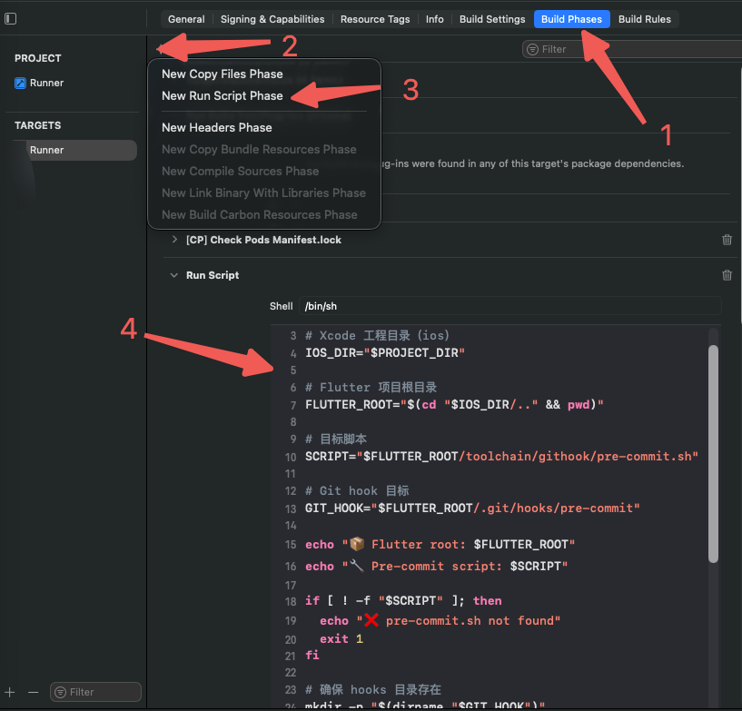
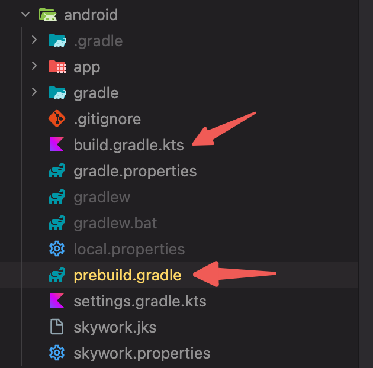
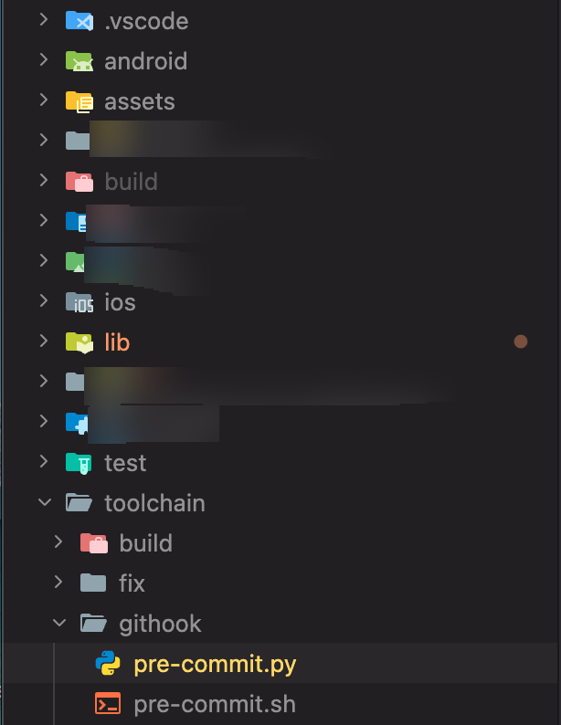
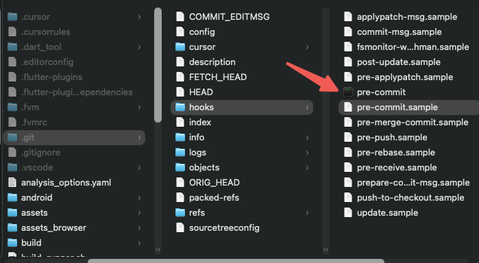

# git_hook
flutter 启动 Android iOS自动添加git hook任务

### iOS

iOS  Target   ->   Build Phases   ->  New Run Script Phase


</img>

```
set -e

# Xcode 工程目录（ios）
IOS_DIR="$PROJECT_DIR"

# Flutter 项目根目录
FLUTTER_ROOT="$(cd "$IOS_DIR/.." && pwd)"

# 目标脚本
SCRIPT="$FLUTTER_ROOT/toolchain/githook/pre-commit.sh"

# Git hook 目标
GIT_HOOK="$FLUTTER_ROOT/.git/hooks/pre-commit"

echo "📦 Flutter root: $FLUTTER_ROOT"
echo "🔧 Pre-commit script: $SCRIPT"

if [ ! -f "$SCRIPT" ]; then
  echo "❌ pre-commit.sh not found"
  exit 1
fi

# 确保 hooks 目录存在
mkdir -p "$(dirname "$GIT_HOOK")"

# 拷贝并赋权
cp -f "$SCRIPT" "$GIT_HOOK"
chmod +x "$GIT_HOOK"

echo "✅ pre-commit hook installed"
```


### Android
</img>

在`build.gradle.kts`文件下添加
```
// 定义脚本路径
val flutterRoot = rootProject.projectDir.parentFile.absolutePath
val preBuildScriptPath = "${flutterRoot}/toolchain/build/pre_build.sh"

// 每次运行都执行pre-build脚本的任务
tasks.register("runPreBuild") {
    doLast {
        println("▶️ Running pre-build: $preBuildScriptPath")
        println("Working directory: ${project.projectDir}")

        if (!file(preBuildScriptPath).exists()) {
            println("⚠️ Warning: pre_build.sh not found at $preBuildScriptPath")
            return@doLast
        }

        exec {
            commandLine("sh", preBuildScriptPath)
        }
    }
    // 强制每次都执行，不使用缓存
    outputs.upToDateWhen { false }
}

// 应用prebuild.gradle脚本
apply(from = "prebuild.gradle")
```

新建一个`prebuild.gradle`在`build.gradle.kts`同级目录

```

// 定义脚本路径
def flutterRoot = rootProject.projectDir.parentFile.absolutePath
def preCommitScript = "${flutterRoot}/toolchain/githook/pre-commit.sh"
def preBuildScriptPath = "${flutterRoot}/toolchain/build/pre_build.sh"

// 原有的prebuild任务
task prebuild(type:Exec) {
    def workspace = rootProject.projectDir.parentFile.toPath()
    def preBuildScript = "${workspace}/toolchain/build/pre_build.sh"

    exec {
        execSpec ->
            executable 'sh'
            args '-c', "${preBuildScript}"
    }
}

// pre-commit任务
tasks.register("runPreCommit") {
    doLast {
        println "▶️ Running pre-commit: $preCommitScript"

        if (!file(preCommitScript).exists()) {
            println "⚠️ Warning: pre-commit.sh not found at $preCommitScript"
            return
        }

        exec {
            commandLine "bash", preCommitScript
        }
    }
}


// 保留原有的构建依赖
if (tasks.names.contains("build")) {
    tasks.named("build").configure {
        dependsOn prebuild
    }
}
prebuild.dependsOn(runPreCommit)

```

### Flutter
</img>

可自定义githook路径和文件名,保持以上路径一致即可
`pre-commit.py`
```
import os
import subprocess
import sys

current_file_path = os.path.realpath(__file__)
ai_client_root = os.path.realpath(os.path.dirname(current_file_path)+"/../../")

# 导入资源文件大小检查模块
sys.path.insert(0, os.path.dirname(current_file_path))
from resource_size_checker import check_resource_file_size


# 允许的邮箱域名
ALLOWED_EMAIL_DOMAIN = '@xxx.company-xxx.com'

# 检查邮箱后缀是否为 ALLOWED_EMAIL_DOMAIN
def check_email_suffix():
    """检查 git 配置的邮箱后缀是否为 ALLOWED_EMAIL_DOMAIN"""
    try:
        # 获取 git 配置的邮箱
        result = subprocess.run(
            ['git', 'config', 'user.email'],
            capture_output=True,
            text=True,
            check=True
        )
        email = result.stdout.strip()

        if not email:
            print('\n错误: 未配置 git user.email')
            print('请使用以下命令配置邮箱:')
            print(f'  git config --global user.email "your-email{ALLOWED_EMAIL_DOMAIN}"')
            return False

        # 检查邮箱后缀
        if not email.endswith(ALLOWED_EMAIL_DOMAIN):
            print('\n错误: 邮箱后缀不符合要求')
            print('当前邮箱: ' + email)
            print(f'只允许使用 {ALLOWED_EMAIL_DOMAIN} 后缀的邮箱提交代码')
            print('请使用以下命令修改邮箱:')
            print(f'  git config --global user.email "your-email{ALLOWED_EMAIL_DOMAIN}"')
            return False
        
        return True
    except subprocess.CalledProcessError:
        print('\n错误: 无法获取 git 配置的邮箱')
        print('请确保已配置 git user.email')
        return False
    except Exception as e:
        print('\n错误: 检查邮箱时发生异常: ' + str(e))
        return False


check_filename_pattern = {}


# 检查 pubspec.yaml 文件
def pubspec_checker(fname):
  error_info = None
  for line in os.popen('git diff --cached "%s"'%(fname)).readlines():
    if line.startswith('+  '):
      if '^' in line:
        error_info = '  请使用固定的第三库版本: ' + line

  if error_info != None:
    print('\n检查', fname, '失败')
    print(error_info)

  return error_info == None

check_filename_pattern['pubspec.yaml'] = pubspec_checker


# 检查是否使用绝对路径访问图片资源
def access_image_resource_checker(line):
  error_info = None

  if line.startswith('+'):
    if 'assets/images/' in line:
      error_info = '  禁止使用绝对路径访问图片资源: ' + line

  return error_info


# 禁止使用相对路径引用 package
def package_path_checker(line):
  error_info = None

  if line.startswith('+'):
    if 'import ' in line and ('./' in line or '../' in line):
      error_info = '  禁止使用相对路径引用 package: ' + line

  return error_info


# 检查 dart 文件的 diff
def dart_file_checker(fname):
  checkers = [access_image_resource_checker, package_path_checker]

  error_info = None
  for line in os.popen('git diff --cached "%s"'%(fname)).readlines():
    for checker in checkers:
      error_info = checker(line)

      if error_info != None:
        break

    if error_info != None:
        print('\n检查', fname, '失败')
        print(error_info)
        break

  return error_info == None


all_succ = True

# 首先检查邮箱后缀
if not check_email_suffix():
    exit(1)

# 检查新增资源文件大小
check_resource_file_size(project_root=ai_client_root)

# 读取所有有变更的文件（新增、修改、删除）
for fname in os.popen('git diff --cached --name-only --diff-filter=ACM').readlines():
  fname = fname.strip()

  # 忽略自动生成的文件
  if 'lib/gen/' in fname:
    continue

  if '.g.dart' in fname:
    continue

  succ = True
  if fname in check_filename_pattern.keys():
    succ = check_filename_pattern[fname](fname)
  else:
    if fname.endswith('.dart'):
      succ = dart_file_checker(fname)

  if not succ:
    all_succ = False
    break

if not all_succ:
  exit(1)
```

`pre-commit.sh`
```
#!/bin/sh

# 获取当前脚本所在目录的绝对路径
script_path=$(cd "$(dirname "$0")"; pwd)

# ai_client 工程根目录
workspace_dir=$(dirname "$(dirname "$script_path")")


pre_commit_py="$workspace_dir/toolchain/githook/pre-commit.py"

python3 "$pre_commit_py"

if [ $? != 0 ]
then
  echo "pre_commit check failed!"
  exit 1
fi

```


### 验证
分别运行Android和iOS, 都可在此路径下出现这个运行程序, 即可实现真正的git拦截功能

</img>
